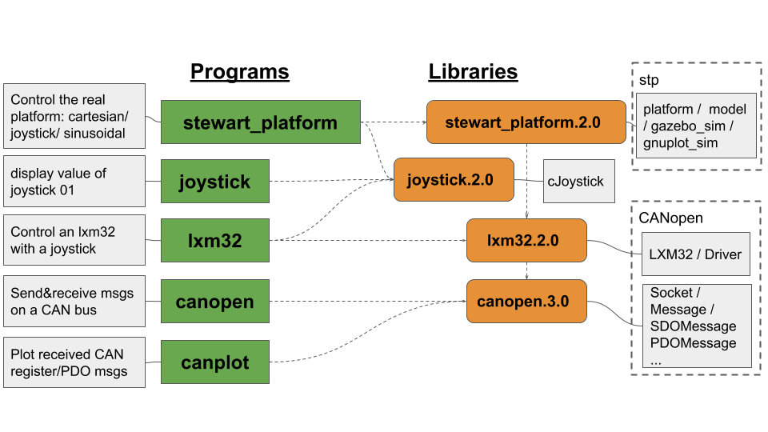
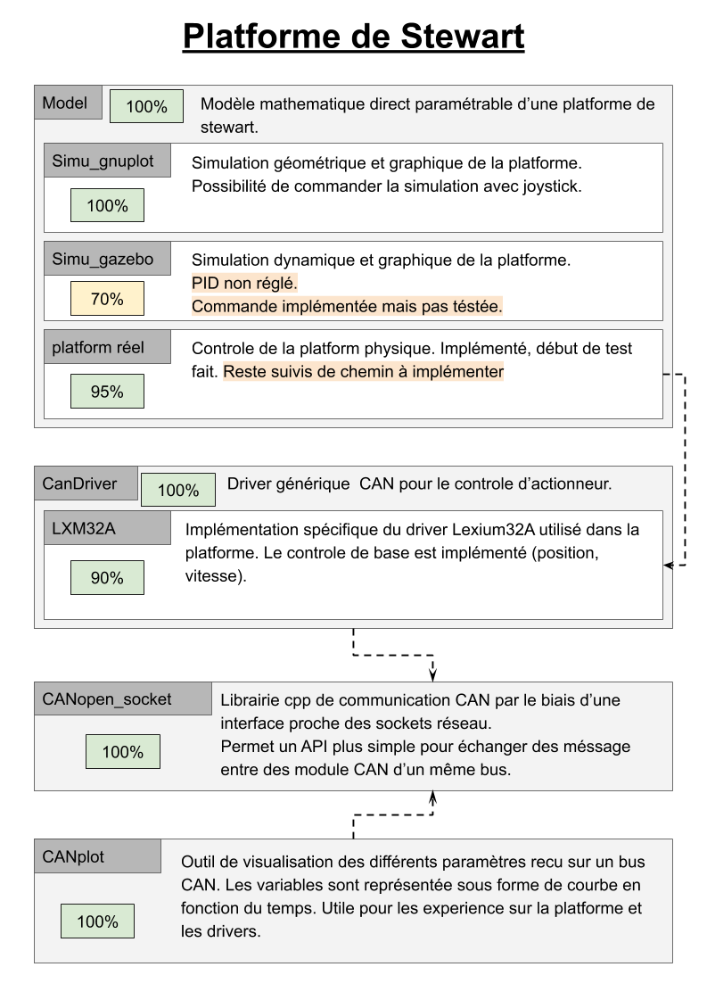

# stewart_platform

Project to control the Stewart platform. The platform use to be control via an OLIMEX board doing the interface IP/CAN to communicate with the servo’s drivers. This project aims to bypass this hardware to communicate directly with the CANopen bus of the lxm32a drivers.




## Usage
### Clone
```bash
git clone https://gitlab-dev.isir.upmc.fr/devillard/stewart_platform.git
```

### Setup
```bash
cd stewart_platform/ && ./switchon_can_interface.sh
```

### Build
```bash 
mkdir build && cd build && cmake .. && make
```

### Run
```bash
./stewart_platform
```

## Electrical Design


## Stucture and Parameters used
### Globale


### Base


