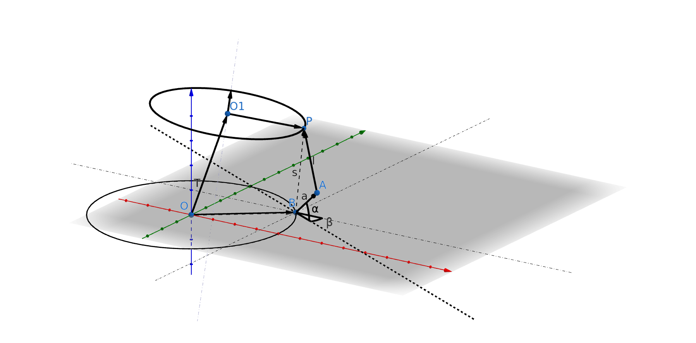
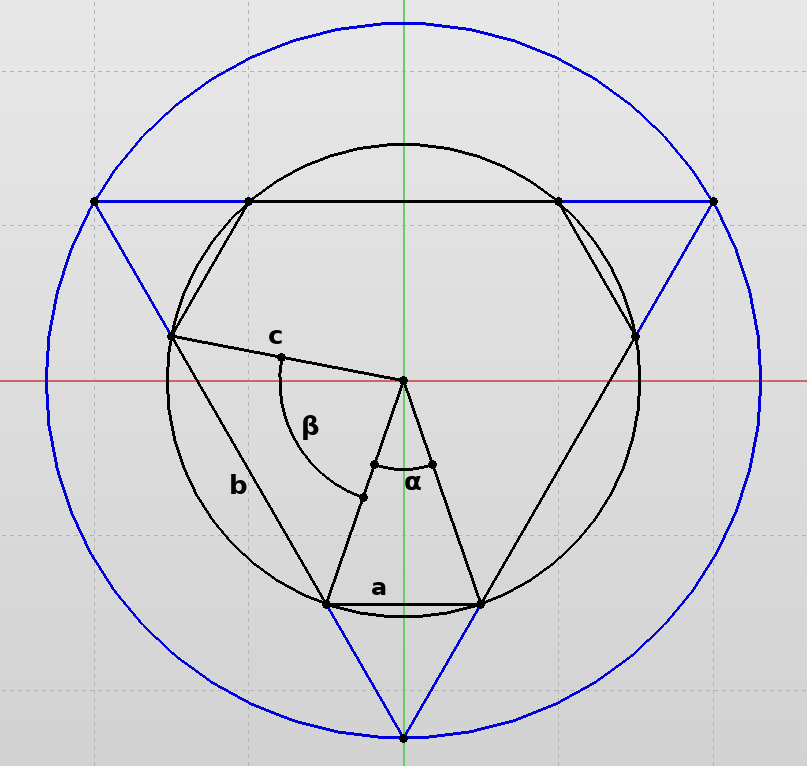

# stewart_platform

Project to control the Stewart platform. The platform use to be control via an OLIMEX board doing the interface IP/CAN to communicate with the servo’s drivers. This project aims to bypass this hardware to communicate directly on the CANopen bus.

## Electrical Design

## Stucture and Parameters used
### Globale

### Base

